

## Projects

### [Stealth Messenger](https://apps.apple.com/pk/app/safi-stealth-messenger/id1006457669) | (Xeven Solutions (Pvt) Ltd.)
- **Role:** iOS Developer 

- **Technologies:**
  
  
  
  
  
  
  
  
  
  
    
  

- **Features:**
  - Secure communication tool designed to protect against phishing, smishing, and ransomware attacks without requiring phone numbers or emails.
  - Supported group chats, video calls, in-app purchases, and end-to-end encrypted messaging.
  - Custom theme change functionality, allowing users to personalize their interface.

- **Challenges & Solutions:**
  - Successfully converted the app to support offline storage, improving user engagement and ensuring seamless functionality without internet access.
  - Launched the app on the App Store, delivering a secure messaging solution.
  - Optimized data fetching and UI performance, resolving issues with large datasets.

#### Screenshots:

  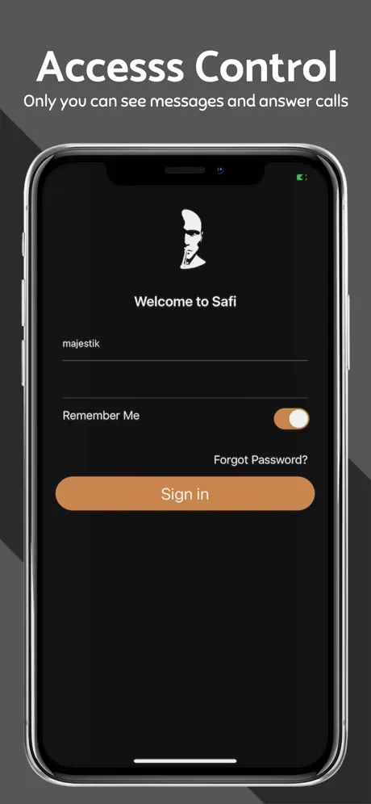
  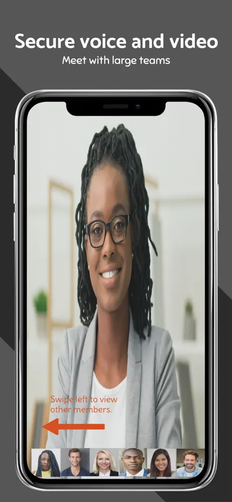
  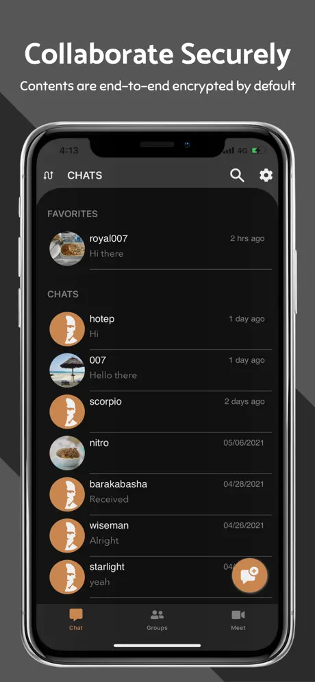
  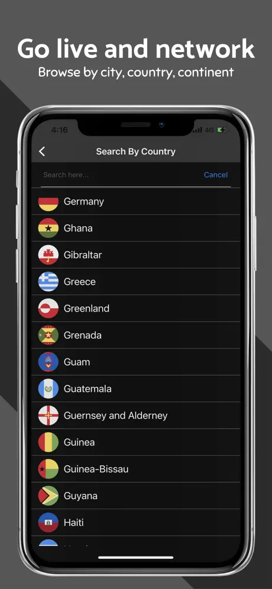

### [The Doc App](https://apps.apple.com/pk/app/the-doc-app/id1193483405) | (Xeven Solutions (Pvt) Ltd.)
- **Role:** iOS Developer 

- **Technologies:**
  
  
  
  
  
  
  
  
  
  
    
  
  
- **Features:**
  - Developed an intuitive Electronic Medical Records (EMR) application that streamlines healthcare data management and enhances patient care delivery.
  - Enabled patients to:
  - View appointment history.
  - Contact healthcare providers and see their location.
  - View purchases, make payments, and review invoices.

- **Challenges & Solutions:**
  - Data Synchronization: Overcame challenges related to healthcare data synchronization and management by utilizing Azure for cloud-based storage and real-time data updates.
  - Regulatory Compliance: Ensured compliance with healthcare regulations while maintaining a high level of security, particularly with patient data during live video calls and communications.
  - Deployment Success: Deployed the app live in the United States, delivering a robust solution for healthcare professionals and patients.

#### Screenshots:

  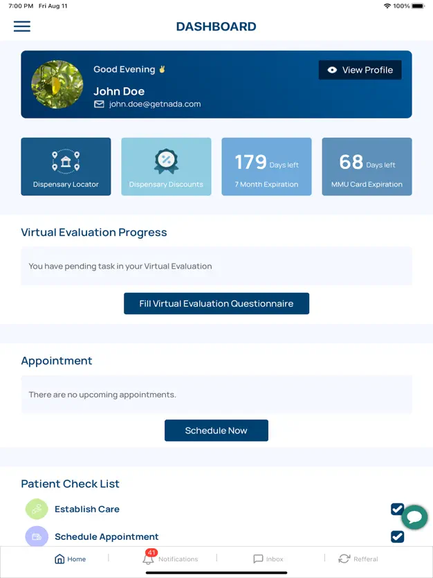
  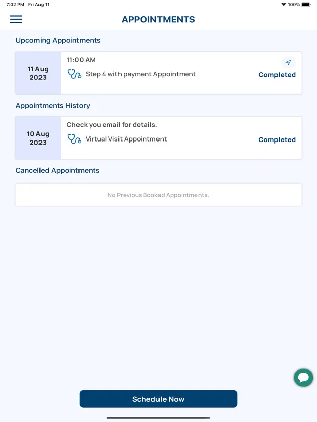
  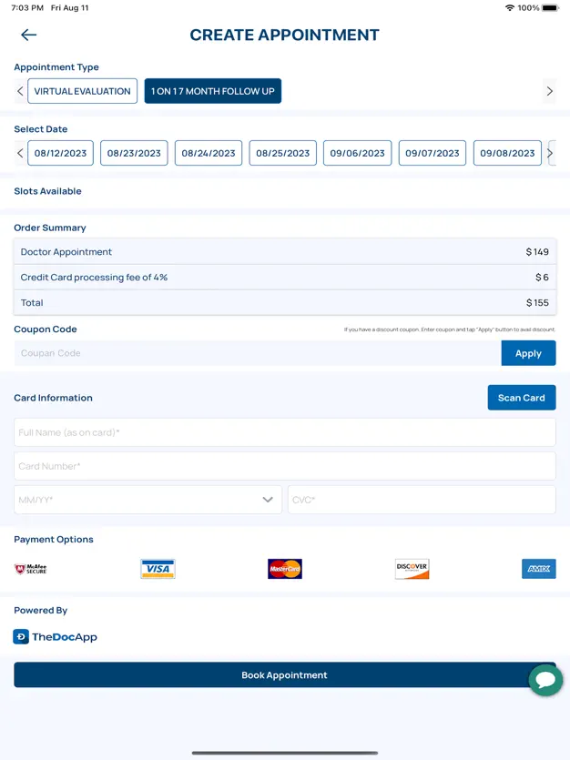
  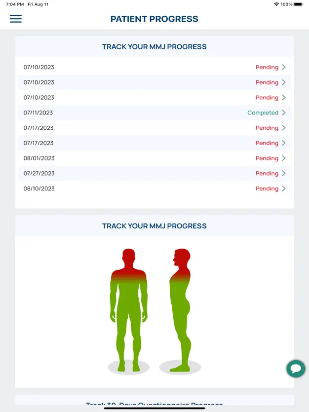

# iHakeem 

Available on App Store! Link: [iHakeem](https://apps.apple.com/us/app/ihakeem/id1536719251?platform=iphone)

## Project Details

| **Attribute**          | **Description** |
|------------------------|------------------|
| **Company Name**       | Alamana Technology Gen. Trading Co, Kuwait |
| **Project Duration**   | June 2021 to October 2022 |
| **Tools/Technologies/Environment** |  Swift(5), Azure, Socket.IO, HealthKit, Almaofire, Lottie-Animations, Google Maps, Google Places, Firebase, CoreData, Core-Bluetooth, Knet Payment Method, OpenTok(Video Calling), MVVM, Agile Methodologies, Jira | 
| **Role**               | iOS Developer |
| **Team Size**          | 7 |
| **Project Domain**     | The iHakeem project aimed to revolutionize healthcare experiences by seamlessly connecting users to a vast network of healthcare providers, offering advanced and accessible services, Including features like video calls, secure payment processing with saved receipts, and the ability to locate nearby pharmacies and order medications directly from the iHakeem app. |
| **Major Achievements** | Achieved successful integration of hardware devices with the application, even when SDKs were not available or supported. Developed, led, and successfully deployed the project live in Kuwait. |

#### Screenshots:

  
  
  
  

# Intely Health

## Project Details

| **Attribute**          | **Description** |
|------------------------|------------------|
| **Company Name**       | iMedHealth, USA |
| **Project Duration**   | Aug 2022 to Dec 2023 |
| **Tools/Technologies/Environment** | Swift UIKit, Xcode, iOS SDKs,loud Service Azure,Socket.IO,
 Unit Testing, Almaofire, Firebase|
| **Role**               | iOS Developer |
| **Team Size**          | 8 |
| **Project Domain**     | The project aimed to revolutionize healthcare experiences by seamlessly connecting users to an extensive network of healthcare providers.|
| **Major Achievements** | Dynamically pointed out joints on the avatar during calls, enhancing visual correlation with patient concerns.Extracted pointed joints from the avatar's URL and processed them on the server for accurate details. Project leadership, Software Development,Integration of software components|

  
  
  
  

# HSA Second Opinion 
Available on App Store! Link: [HSA](https://apps.apple.com/us/app/hsa-second-opinion/id6503679610)
## Project Details

| **Attribute**          | **Description** |
|------------------------|------------------|
| **Company Name**       | HSA Second Opinion, Pakistan|
| **Project Duration**   |Fab 2024 to Aug 2024 |
| **Tools/Technologies/Environment** | SwiftUI, Xcode, iOS SDKs, JazzCash, SendbirdUIKit, Alamofire, Agile Methodologies, Jira, MVVM, Firebase, Moduler Approch|
| **Role**               | iOS Developer |
| **Team Size**          | 3 |
| **Project Domain**     | Expertly developed the HSA Second Opinion Utility App, enabling users to securely obtain professional medical opinions and real-time consultations from experienced doctors, all from the convenience of their home or office.|
| **Major Achievements** |Integrated software components and successfully deployed the application on the Play Store.|

  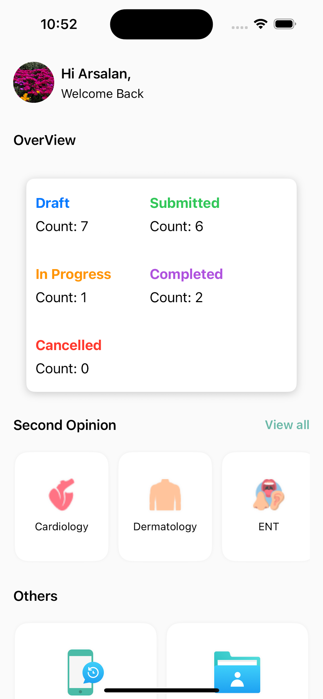
  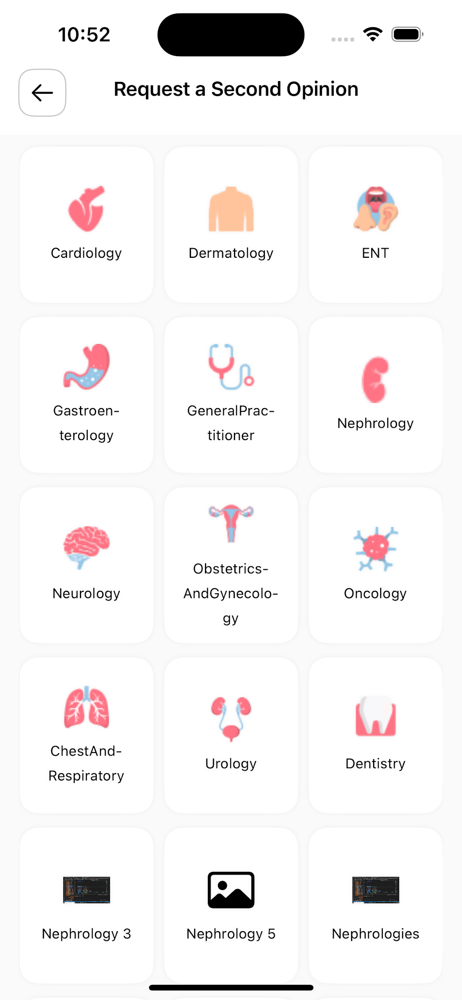
  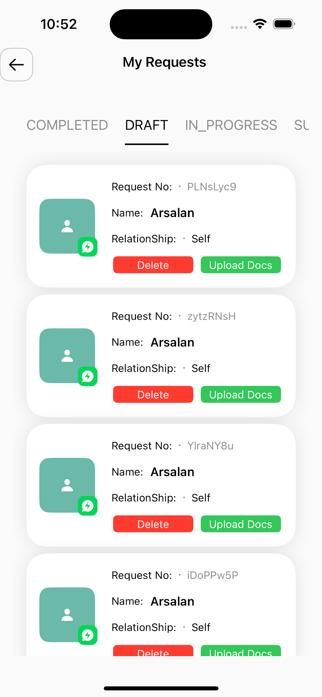
  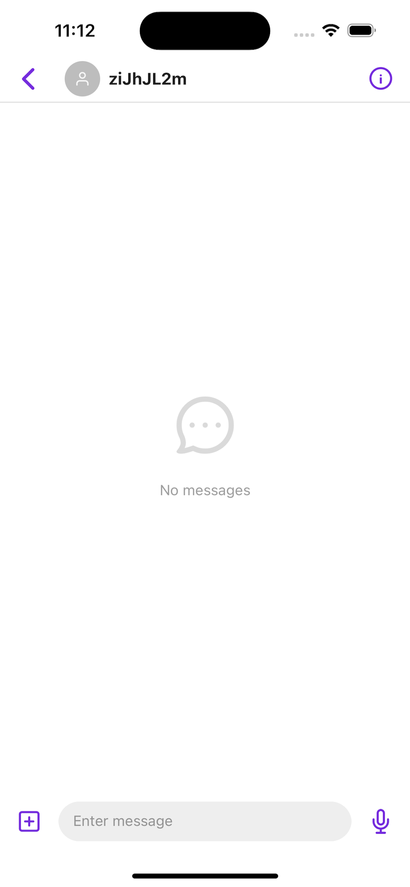

# MedicalAI 

## Project Details

| **Attribute**          | **Description** |
|------------------------|------------------|
| **Company Name**       | My Florida Green, Naples, Florida 34119 |
| **Project Duration**   |Dec 2023 to Fab 2024 |
| **Tools/Technologies/Environment** | SwiftUI, Xcode, iOS SDKs, OpenAI, ImageProcessing, Socket.IO, Combine, Moduler Approch|
| **Role**               | iOS Developer |
| **Team Size**          | 4 |
| **Project Domain**     | Pioneered the development of Medical AI, a groundbreaking health companion crafted with SwiftUI. The project harnessed advanced OpenAI technology to introduce an innovative chatbot, offering insightful and engaging health-related conversations.|
| **Major Achievements** | Project leadership, Software Development,Integration of software components|

  
  
  
  

# Book With Star

Available on App Store! Link: [BWS](https://apps.apple.com/pk/app/book-with-star/id1629308220) 

**Project Overvieww**

## Project Details

| **Attribute**          | **Description** |
|------------------------|------------------|
| **Company Name**       | Book With Star, UAE|
| **Project Duration**   | March 2022 to Oct 2022 |
| **Tools/Technologies/Environment** | SwiftUI, Xcode, iOS SDKs, AVFoundation, Combine, Google Maps, Firebase|
| **Role**               | iOS Developer |
| **Team Size**          | 4 |
| **Project Domain**     | Developed the Star Academies app to streamline coaching and learning for students and coaches, offering easy access to training schedules, lesson plans, and attendance tracking, all while keeping users updated with academy news.|
| **Major Achievements** |Bridged UIKit with integrated software components, leading to a successful deployment on the Play Store.|

  
  
  

# Star Academies Coaches

Available on App Store! Link: [Coaches](https://apps.apple.com/pk/app/star-academies-coaches/id1540379452) 

**Project Overvieww**

## Project Details

| **Attribute**          | **Description** |
|------------------------|------------------|
| **Company Name**       | Book With Star, UAE|
| **Project Duration**   | Jan 2021 to Dec 2022 |
| **Tools/Technologies/Environment** |  Objective-C, Xcode, iOS SDKs, AVFoundation, Alamofire, Live Channels|
| **Role**               | iOS Developer |
| **Team Size**          | 4 |
| **Project Domain**     | The application is strategically designed to elevate the overall educational experience, with a particular focus on students aspiring to become coaches. By seamlessly organizing day-to-day workloads, the app enhances efficiency and empowers students on their educational journey.|
| **Major Achievements** | Successful Technical go-live.|

  
  
  
   

# Book with Star Admin

Available on App Store! Link: [BwsAdmin](https://apps.apple.com/pk/app/book-with-star-admin/id6451918028)

**Project Overvieww**

## Project Details

| **Attribute**          | **Description** |
|------------------------|------------------|
| **Company Name**       | Book With Star, UAE|
| **Project Duration**   | July 2023 to oct 2023 |
| **Tools/Technologies/Environment** |Swift UIKIT, Xcode, iOS SDKs, Combine, Kingfisher, Lottie-Animations|
| **Role**               | iOS Developer |
| **Team Size**          | 4 |
| **Project Domain**     |  This cutting-edge sports tournament management app is strategically designed to enhance the experience for players, team managers, and referees, setting a new standard in the industry.|
| **Major Achievements** |In a remarkable achievement, the Book with Star Admin app was successfully delivered within a tight 3-month timeframe and successfully go-live |

  
  
  
   

# Assessments 

# Code2.0

Faced with a 5-day coding challenge, I successfully delivered a fully functional movie app in just 2 days. Built using SwiftUI, this app fetches and displays movie data in a dynamic grid, allows users to mark favorites, and provides detailed movie information. With offline support powered by Realm and a focus on smooth performance, I meticulously applied modular design principles and the MVVM architecture to ensure a modern and efficient solution.

Explore the project and contribute on GitHub: [Code2.0](https://github.com/ArslaniOS/Code2.0.git).

  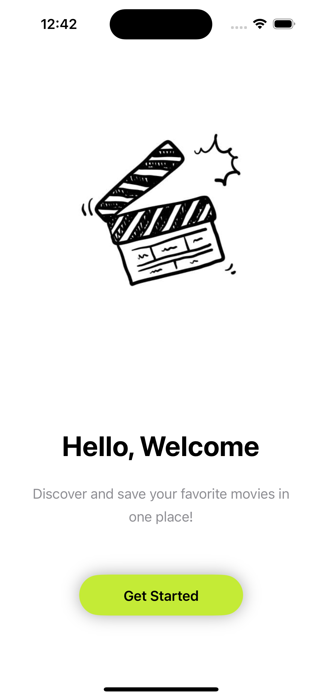
  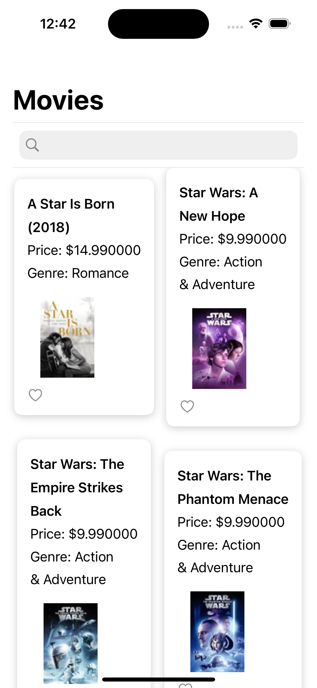
  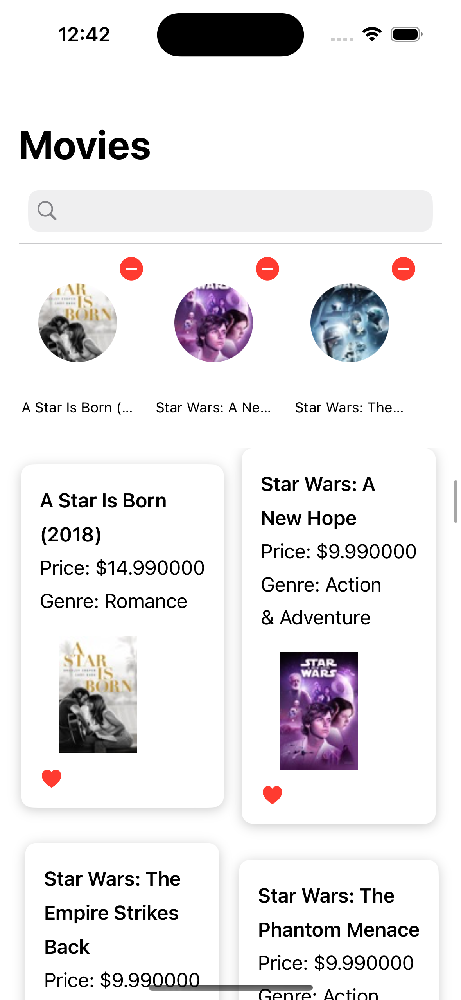
   

