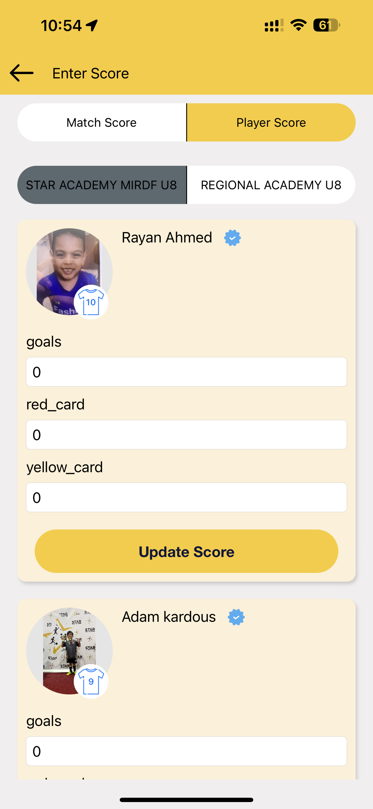

&nbsp;&nbsp;&nbsp;&nbsp;

# iOS Apps

# iHakeem 

Available on App Store! Link: [iHakeem](https://apps.apple.com/us/app/ihakeem/id1536719251?platform=iphone)

iHakeem, a revolutionary healthcare platform crafted entirely in Swift with UIKit, redefines your healthcare experience by seamlessly connecting you with a vast network of healthcare providers. Whether you're at home or outdoors, requiring immediate or urgent consultation, iHakeem ensures advanced and accessible healthcare services.

Key Features:

- Both virtual (chat, video) and walk-in appointment booking
- Get an e-prescription sent to the pharmacy
- Medication and lab test delivery to your home
- Use your smartwatch and other compatible devices for remote monitoring
- Medications, Readings, and appointment reminder
- Health care tips and packages for a healthy lifestyle
- Use your health insurance as its typically done
- Chronic prescription refills from your doctor
  
Project Highlights:

Challenges and Solutions:

In the development of iHakeem, I encountered a significant challenge when I initially couldn't find the necessary SDKs for integrating hardware medical devices seamlessly. Determined to provide users with a comprehensive healthcare experience, I embarked on a self-study journey into Bluetooth Core Low Energy (BLE) and High Energy (Classic).

Upon thorough exploration of the Bluetooth manuals and understanding the intricacies of native UUIDs, I successfully devised a solution to connect iHakeem with essential medical devices. This included integrating functionalities for weight measurement, Omron blood pressure monitoring, and blood sugar level tracking.

This proactive approach not only showcased my commitment to overcoming obstacles but also enriched iHakeem's capabilities, allowing users to seamlessly incorporate vital health data into their comprehensive healthcare journey. This endeavor reflects my dedication to achieving technical excellence and delivering a holistic healthcare solution to users.

MVVM Architecture

iHakeem is built using the MVVM (Model-View-ViewModel) architecture, ensuring a modular and scalable codebase.
Agile Methodology:

The development process adhered to Agile methodology, fostering collaboration, flexibility, and iterative enhancements throughout the project lifecycle.
This project reflects a significant milestone in enhancing healthcare accessibility and user experience. Download iHakeem now to elevate your healthcare journey to unprecedented heights. 

 

 
   
   
   

# Intely Health

Introducing Intely health, a revolutionary healthcare application meticulously crafted in Swift with UIKit. Intely health transforms your healthcare journey by seamlessly connecting you with an extensive network of healthcare providers. Whether you seek immediate virtual consultation or prefer a walk-in appointment, Intely health ensures advanced and accessible healthcare services for your entire family.

Key Features:

Convenient virtual (chat, video) and walk-in appointment booking
Enjoy the convenience of medication and lab test delivery to your doorstep
Utilize your smartwatch and compatible devices for remote health monitoring
Receive medication reminders, track vital readings, and stay on top of appointments
Access healthcare tips and curated packages for maintaining a healthy lifestyle
Seamlessly use your health insurance as typically done
Simplify chronic prescription refills through easy communication with your doctor

Exciting News:
Intely health will soon be available on TestFlight, bringing advanced healthcare solutions to your fingertips. 
Embrace a new era of healthcare accessibility with Family Doc!

 

 
 
 
 

# MedicalAI 

Introducing Medical AI, an innovative health companion designed with SwiftUI, currently under active development. Medical AI leverages cutting-edge OpenAI technology to provide users with a unique chatbot experience for discussing health-related articles. Users can seamlessly engage in conversations with the chatbot, exploring a wide range of health topics.

Key Features:

Interactive Chatbot: Engage in informative conversations with the AI-powered chatbot
Health Article Discussions: Discuss and explore a variety of health-related articles
Email Chat Transcripts: Conveniently email chat transcripts for future reference or sharing
Article Search Functionality: Easily search and access a vast database of health articles
SwiftUI Interface: Enjoy a modern and user-friendly interface crafted with SwiftUI
Medical AI is poised to revolutionize how users interact with health information, providing a dynamic platform for discussions and insights. Stay tuned for exciting updates as we continue to enhance and refine the Medical AI experience. Join us on the journey to a smarter, more accessible healthcare future!

 

 
 
 
 

# Star Academies Coaches

Available on App Store! Link: [Coaches](https://apps.apple.com/pk/app/star-academies-coaches/id1540379452) 

This comprehensive app not only facilitates sports enthusiasts but also serves as an invaluable tool for coaches and students. Offering real-time access to crucial academy news and updates, it ensures everyone stays informed. Beyond its primary role in sports, the app is designed to elevate the educational experience, particularly for students aspiring to become coaches. By seamlessly organizing their day-to-day workload, the app enhances efficiency and empowers students on their educational journey.

 

 
 
 
 

# Star Volleyball Academy

Available on App Store! Link: [Volleyball](https://apps.apple.com/pk/app/star-volleyball-academy/id6463856723)  

The Star Volleyball Academy app, established in 2023, epitomizes excellence in sports education in the UAE. Catering to aspiring athletes of all ages, the app seamlessly integrates with the Academy's training programs. Offering easy venue selection and class bookings for volleyball sessions in Dubai and Sharjah, the app ensures a smooth payment process through a secure gateway. With features like effortless registration and in-app payments, it fosters a vibrant community, providing instant access to athlete progress reports, training outlines, and exclusive media content, including instructional videos. This app serves as a comprehensive platform, connecting parents, students, and athletes with the dynamic world of volleyball training and events.

Project Highlights:

Objective-C and Swift Development: Leveraged the capabilities of both Objective-C and Swift languages to create a versatile and robust application.

Agile Methodology: Employed an agile development approach, fostering flexibility, collaboration, and iterative enhancements throughout the project lifecycle.

UI Self-Design: Took ownership of the UI design, ensuring a user-friendly and visually appealing interface to enhance the overall user experience.

 

 
  
  
  

# Star Gymnastics Academy

Available on App Store! Link: [Gymnastics](https://apps.apple.com/pk/app/star-gymnastics-academy/id6464569426)  

Gymnastics, inspired by the essence of volleyball with subtle modifications, brings forth a familiar yet distinctive sporting experience. The journey to release this application on the App Store presented some challenges that added a unique touch to the development process.

In the face of App Store submission, ensuring compliance with Apple's guidelines and policies became a noteworthy challenge. Rigorous testing and adherence to the stringent criteria for app approval were pivotal in overcoming these hurdles. Additionally, implementing strategic optimizations for performance and user engagement played a crucial role in enhancing the overall quality of the application.

Gymnastics stands as a testament to the dedication and problem-solving skills exhibited during the development journey, resulting in a refined and enjoyable sports application.

 

 
 
 
 

# Book With Star

Available on App Store! Link: [BWS](https://apps.apple.com/pk/app/book-with-star/id1629308220) 

The app, developed with SwiftUI, adheres to MVVM architecture and embraces agile methodologies, epitomizing efficiency and innovation in sports engagement.

In the dynamic climate of the United Arab Emirates, leveraging the outdoors is essential for a vibrant lifestyle. Book with Star emerges as the ultimate facilitator, simplifying the quest for engaging and enjoyable activities. Whether your passion lies in outdoor sports like soccer or you prefer the camaraderie of indoor pursuits such as basketball, Book with Star ensures seamless access to premier facilities in your vicinity. Tailored for both adults seeking sports leagues and children pursuing athletic education, our platform fosters a diverse sports community.

Challenges and Solutions:

Overcoming a significant hurdle, I successfully implemented a custom searchable popup list in SwiftUI for the Book with Star app. Faced with the absence of native third-party solutions, I embraced the challenge of creating a proprietary framework tailored to the unique needs of the app. This involved a meticulous process of design, development, and integration, ensuring a seamless and user-friendly experience for the platform. The result is a cutting-edge feature that enhances user interaction, demonstrating the app's commitment to innovation and tailored solutions.

 

 
 
 

# Book with Star Admin

Available on App Store! Link: [BwsAdmin](https://apps.apple.com/pk/app/book-with-star-admin/id6451918028)

Successfully delivered within a 3-month timeframe, Book with Star Admin is a cutting-edge sports tournament management app designed to elevate the experience for players, team managers, and referees alike. With a user-friendly interface catering to both novices and seasoned organizers, the app provides real-time updates on fixtures, results, and standings.

Key functionalities include seamless player and team registration, comprehensive tournament and match management modules, and dedicated features for referees. The app ensures accurate and transparent match data for post-game analysis. Boasting robust data analytics tools, Book with Star Admin offers valuable insights into player and team performance.

Security is a top priority, with the app incorporating robust encryption and privacy features to safeguard user data. Additionally, users benefit from 24/7 customer support, ensuring a smooth and enjoyable experience throughout the tournament season.

Project Highlights:

MVVM Architecture

The development process followed the Agile methodology, promoting collaborative efforts, adaptability, and iterative improvements across the project lifecycle.
 
 

 
   
   
   

