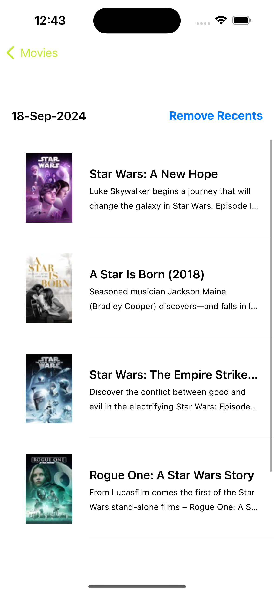

## Projects

### Urban Mop 
- **Role:** iOS Developer
- **Technologies:**

- **Features:**
  - Driver Dashboard: Provides a comprehensive overview of earnings, trip history, and upcoming ride requests.
  - Real-Time Navigation: Integrated Google Maps for accurate navigation and route optimization.
  - Ride Notifications: Firebase-powered real-time notifications for ride requests, updates, and cancellations.
    
 **Challenges & Solutions:**
  - Real-Time Tracking: Leveraged Firebase and Socket.IO for live trip updates and location tracking.
  - Scalable Architecture: Designed a robust system to manage high ride request volumes efficiently.
  - Enhanced User Experience: Developed a driver-friendly interface for easy access to trip details and navigation.
  - Deadline Mastery: Delivered the app ahead of schedule, ensuring all features were rigorously tested and optimized.

  

    
    
    
    
   
   
       
  

### Urban Mop 
- **Role:** iOS Developer
- **Technologies:**

- **Features:**
  - Comprehensive Home Services: Users can book a wide range of services, including sofa cleaning, maid services, AC maintenance, and other home appliance repairs.
  - Flexible Payment Options: Supports Telr, Tabby, Stripe, wallet, cash, and rewards-based payments for user convenience.
  - Seamless Booking Experience: A streamlined process for service selection, scheduling, and payments.
    
 **Challenges & Solutions:**
  - Payment Gateway Integration: Integrated multiple payment options for a flexible and secure payment experience.
  - Dynamic Service Management: Designed a scalable architecture to handle various service categories efficiently.
  - User-Centric Design: Crafted a clean and intuitive interface for effortless navigation and booking.on.
  - Deadline Mastery: Delivered the project ahead of schedule, meeting tight timelines while ensuring high-quality standards.

  

    
    
    
    
   
   
  

### MedicalAI 
- **Role:** iOS Developer
- **Technologies:**

- **Features:**
  - Innovative Chatbot: Developed a health companion chatbot powered by OpenAI for engaging conversations.
  - User-Friendly Interface: Crafted using SwiftUI for a modern and intuitive user experience.
  - Real-Time Interaction: Enabled seamless interactions between users and the chatbot for immediate responses.
    
 **Challenges & Solutions:**
  - Integration of OpenAI: Successfully integrated OpenAI technology to ensure accurate and relevant health conversations.
  - Performance Optimization: Implemented performance optimizations for smooth user interactions and fast response times.
  - Modular Architecture: Adopted a modular approach to ensure maintainability and scalability of the application.
  - Tight Deadline Challenge: Faced the challenge of building the app in SwiftUI with a tight deadline of 2 months while still being relatively new to SwiftUI. Managed to learn and implement simultaneously, completing the project in just 15 days ahead of schedule.

  

    
    
    
    
  

### [Star Academies Coaches](https://apps.apple.com/pk/app/star-academies-coaches/id1540379452) | (Star Academies)
- **Role:** iOS Developer
- **Technologies:**  

- **Features:**
  - Educational Enhancement: Designed to elevate the overall educational experience for students aspiring to become coaches.
  - Workload Organization: Seamlessly organized day-to-day workloads, helping users manage their time effectively.
  - Efficiency Boost: Enhanced efficiency in task management, empowering students on their educational journey.
  - Coaching Support: Provided tools and resources specifically tailored for students looking to pursue coaching careers.
    
 **Challenges & Solutions:**
  - Transition to Objective-C: Faced the challenge of working with Objective-C for existing codebases, which required quick adaptation and learning.
  - Integration of Live Channels: Successfully integrated Live Channels for real-time interactions, ensuring a smooth user experience.
  - Deployment Timelines: Managed tight timelines to ensure a successful technical go-live while maintaining high-quality standards.
    

  

    
    
    
    
  

### [iHakeem](https://apps.apple.com/us/app/ihakeem/id1536719251?platform=iphone) | (Xeven Solutions (Pvt) Ltd.)
- **Role:** iOS Developer
- **Technologies:**
  
  
  
  
  
  
  
  
  
  
  
  
    
  

  
- **Features:**
  - Seamlessly connected users to a vast network of healthcare providers, offering advanced services.
  - Integrated video calls for real-time consultations with doctors.
  - Secure payment processing with saved receipts using Knet Payment Method.
  - ContaAbility to locate nearby pharmacies and order medications directly from the app.
    
 **Challenges & Solutions:**
  - Device Integration: Achieved successful integration of hardware devices, even when SDKs were unavailable or unsupported.
  - Deployment: Developed, led, and successfully deployed the project live in Kuwait, enhancing the country's healthcare experience through innovative technology.
    
#### Screenshots:

  

    
    
    
    
  

### [ Book With Star](https://apps.apple.com/pk/app/book-with-star/id1629308220) | (Star Academies)
- **Role:** iOS Developer
- **Technologies:**

- **Features:**
  - Coaching and Learning Platform: Developed the Star Academies app to streamline coaching and learning for students and coaches.
  - Training Schedules: Provided easy access to training schedules, allowing users to plan their sessions efficiently.
  - Lesson Plans: Offered structured lesson plans for better learning outcomes.
  - Attendance Tracking: Implemented attendance tracking features to monitor student participation.
  - News Updates: Kept users informed with real-time academy news and updates.
    
 **Challenges & Solutions:**
  - Integration of UIKit and SwiftUI: Faced the challenge of bridging UIKit with integrated software components, which required extensive troubleshooting and adaptation to ensure compatibility.
  - User Experience Optimization: Optimized the user experience while transitioning to SwiftUI, balancing performance with new features to meet user expectations.
  - Deployment Timelines: Managed tight deadlines while ensuring all components were tested thoroughly before deployment.
  

  

    
    
    
  

### [Stealth Messenger](https://apps.apple.com/pk/app/safi-stealth-messenger/id1006457669) | (Xeven Solutions (Pvt) Ltd.)
- **Role:** iOS Developer 

- **Technologies:**
  
  
  
  
  
  
  
  
  
  
    
  

- **Features:**
  - Secure communication tool designed to protect against phishing, smishing, and ransomware attacks without requiring phone numbers or emails.
  - Supported group chats, video calls, in-app purchases, and end-to-end encrypted messaging.
  - Custom theme change functionality, allowing users to personalize their interface.

- **Challenges & Solutions:**
  - Successfully converted the app to support offline storage, improving user engagement and ensuring seamless functionality without internet access.
  - Launched the app on the App Store, delivering a secure messaging solution.
  - Optimized data fetching and UI performance, resolving issues with large datasets.

#### Screenshots:

  

    
    
    
  

### [The Doc App](https://apps.apple.com/pk/app/the-doc-app/id1193483405) | (Xeven Solutions (Pvt) Ltd.)
- **Role:** iOS Developer 

- **Technologies:**
  
  
  
  
  
  
  
  
  
  
    
  
  
- **Features:**
  - Developed an intuitive Electronic Medical Records (EMR) application that streamlines healthcare data management and enhances patient care delivery.
  - Enabled patients to:
  - View appointment history.
  - Contact healthcare providers and see their location.
  - View purchases, make payments, and review invoices.

- **Challenges & Solutions:**
  - Data Synchronization: Overcame challenges related to healthcare data synchronization and management by utilizing Azure for cloud-based storage and real-time data updates.
  - Regulatory Compliance: Ensured compliance with healthcare regulations while maintaining a high level of security, particularly with patient data during live video calls and communications.
  - Deployment Success: Deployed the app live in the United States, delivering a robust solution for healthcare professionals and patients.

#### Screenshots:

  

    
    
    
    
  

### Intely Health
- **Role:** iOS Developer
- **Technologies:**
  
  
  
  
  
  
  
- **Features:**
  - Dynamically pointed out joints on the avatar during calls, enhancing visual correlation with patient concerns.
  - Extracted pointed joints from the avatar's URL and processed them on the server for accurate details.
  - Integrated real-time communication features to facilitate seamless interactions between patients and providers.
    
 **Challenges & Solutions:**
  - Challenge: Ensuring accurate extraction and processing of avatar data for real-time calls.
    Solution: Implemented robust server-side processing to handle data extraction and visualization efficiently.
  - Challenge: Maintaining performance with extensive data processing during calls.
    Solution: Optimized data handling and implemented efficient algorithms to minimize latency and enhance user experience.
  -  Challenge: Leading a diverse team in a fast-paced environment.
     Solution: Fostered collaboration through regular stand-ups and clear communication channels, ensuring project alignment and timely delivery.

  

    
    
    
    
  

### [HSA Second Opinion](https://apps.apple.com/us/app/hsa-second-opinion/id6503679610) | (Ninja Technologies (Pvt) Ltd.)

- **Role:** iOS Developer
- **Technologies:**
 
 
  
  
  

- **Features:**
  - Securely connects users with healthcare professionals for real-time consultations.
  - Offers seamless payment processing through JazzCash.
  - Integrates messaging capabilities for enhanced communication between patients and doctors.
    
 **Challenges & Solutions:**
  - Challenge: Ensuring secure and reliable communication during consultations.
  - Solution: Implemented Sendbird for secure messaging and real-time communication.
    
  - Challenge: Integrating payment processing with minimal friction for users.
  - Solution:  Integrated JazzCash with a user-friendly interface to streamline the payment process.

  - Challenge: Coordinating a small team to meet tight deadlines.
  - Solution: Utilized Agile methodologies to promote collaboration and quick iterations.
     

  

    
    
    
    
  

# Book with Star Admin
### [Book with Star Admin](https://apps.apple.com/pk/app/book-with-star-admin/id6451918028) | (Star Academies)
- **Role:** iOS Developer
  
- **Technologies:**
   
  

- **Features:**
  - Tournament Management: Designed to enhance the experience for players, team managers, and referees in sports tournaments.
  - User-Friendly Interface: Provided an intuitive and engaging user interface that streamlines tournament operations.
  - Real-Time Updates: Enabled real-time updates and notifications for players and managers, ensuring everyone stays informed.
  - Performance Tracking: Incorporated features for tracking player and team performance throughout tournaments.
    
 **Challenges & Solutions:**
  - Tight Timeline: Successfully delivered the project within a tight 3-month timeframe, requiring effective time management and prioritization.
  - Ensuring Quality: Maintained high-quality standards while meeting deadlines through rigorous testing and continuous feedback loops.
  - Faced the challenge of managing dynamic UI, particularly in handling runtime columns and rows, ensuring a seamless user experience.

  

    
    
    
    
  

### Code2.0
- **Role:** iOS Developer 

- **Technologies:**
 

 

- **Features:**
  - Successfully developed a fully functional movie app within a tight timeline.
  - The app fetches and displays movie data in a dynamic grid, allowing users to mark favorites and access detailed movie information.
  - Integrated offline support powered by Realm for enhanced usability and a seamless user experience.
  - Followed modular design principles and MVVM architecture to ensure an efficient and maintainable codebase.

<!---*Explore the project and contribute on GitHub: [Code2.0](https://github.com/ArslaniOS/Code2.0.git)-->

  

    
    
    
    
  

### Spiral 

- **Role:** iOS Developer 
- **Technologies:**

 

- **Features:**
  - Designed and developed a fully functional app.
  - Delivered a clean, intuitive design with smooth user interactions for a seamless experience.
  - Integrated key functionalities within a short timeframe, meeting all project requirements with precision.
<!---*Explore the project and contribute on GitHub: [Code2.0](https://github.com/ArslaniOS/Code2.0.git)-->

  

    
    
    
    
    
    
  

