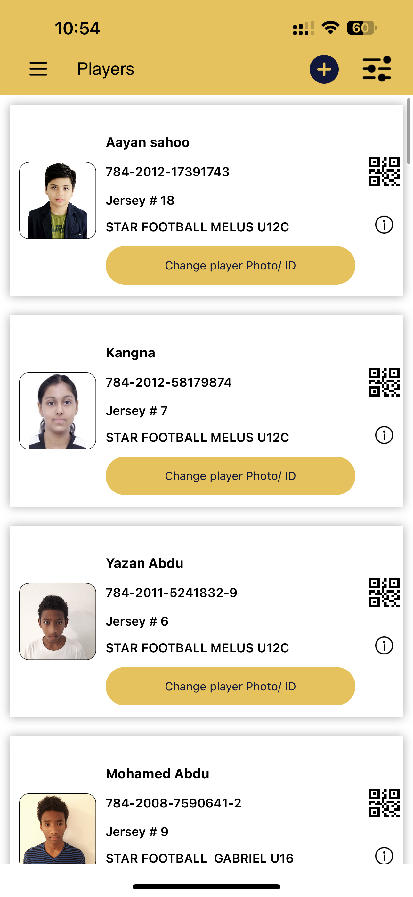

&nbsp;&nbsp;&nbsp;&nbsp;

# iOS Apps

# iHakeem 

Available on App Store! Link: [iHakeem](https://apps.apple.com/us/app/ihakeem/id1536719251?platform=iphone)

Project Overview:
Led the development of iHakeem, a cutting-edge healthcare platform built with Swift and UIKit. The project aimed to revolutionize healthcare experiences by seamlessly connecting users to a vast network of healthcare providers, offering advanced and accessible services.

Key Features and Achievements:

Comprehensive Healthcare Services:

Provides both virtual (chat, video) and walk-in appointment booking for flexible healthcare consultations.
Seamlessly connects users with a vast network of healthcare providers.
Medication and Lab Test Delivery:

Facilitates e-prescriptions sent directly to the pharmacy.
Ensures medication and lab test delivery to the user's home for added convenience.
Remote Monitoring and Proactive Healthcare:

Enables remote monitoring using smartwatches and compatible devices.
Sends medication, readings, and appointment reminders for a proactive healthcare approach.
Health Promotion and Lifestyle Packages:

Delivers healthcare tips and packages to promote a healthy lifestyle.
Integration of Health Insurance:

Utilizes health insurance seamlessly for a hassle-free experience.
Chronic Prescription Refills:

Facilitates chronic prescription refills from the user's doctor.
Bluetooth Integration for Medical Devices:

Overcame challenges in integrating hardware medical devices, delving into Bluetooth Core Low Energy (BLE) and High Energy (Classic).
Successfully integrated functionalities for weight measurement, Omron blood pressure monitoring, and blood sugar level tracking.
Technical Excellence and MVVM Architecture:

Demonstrated a commitment to technical excellence and user experience enhancement.
Built iHakeem using the MVVM (Model-View-ViewModel) architecture for a modular and scalable codebase.
Agile Methodology:

Adhered to Agile methodology throughout the development process, fostering collaboration and iterative enhancements.
User-Friendly Platform:

Elevate your healthcare journey with iHakeem's innovative and user-friendly platform.
Experience top-notch healthcare from the comfort of your home, consulting with the finest doctors in the city without stepping outside.
Secure and Accessible Health Records:

Ensure complete privacy with secure and easily accessible online health records.
Medication Delivery:

Discover nearby pharmacies and order prescribed medications through iHakeem.
Medications delivered right to your doorstep for added convenience.
The iHakeem project stands as a testament to advancements in healthcare technology, providing users with a holistic and convenient healthcare experience.

 

 
   
   
   

# Intely Health

Project Overview:
Led the development of Intely Health, a groundbreaking healthcare application built using Swift with UIKit. The project aimed to revolutionize healthcare experiences by seamlessly connecting users to an extensive network of healthcare providers.

Key Achievements:

Virtual and Walk-in Appointments:
Enabled users and their families to conveniently book virtual (chat, video) and walk-in appointments.
Medication and Lab Test Delivery:
Facilitated the delivery of medications and lab tests to users' doorsteps for added convenience.
Remote Health Monitoring:
Utilized smartwatches and compatible devices for remote health monitoring, ensuring continuous care.
Health Management Features:
Provided features like medication reminders, vital readings tracking, and easy appointment management.
Access to healthcare tips and curated packages for maintaining a healthy lifestyle.
Integration of Health Insurance:
Seamlessly integrated health insurance processes for user convenience.
Chronic Prescription Refills:
Simplified chronic prescription refills through efficient communication with doctors.
Human Avatar for Doctor-Patient Interactions:
Overcame challenges to implement a human avatar for doctor-patient interactions.
Dynamically pointed out joints on the avatar during calls, enhancing visual correlation with patient concerns.
Extracted pointed joints from the avatar's URL and processed them on the server for accurate details.
Tech Skills:

Software development
iOS development
Integration of software components
Project leadership
Project Goal:
The primary goal of the Intely Health project was to enhance and modernize healthcare delivery by leveraging technology. The focus was on creating a user-friendly platform that connects users with healthcare providers, offers innovative features, and sets a higher standard for interactive healthcare solutions.

Notable Contributions:

Successfully implemented the highly successful human avatar feature, improving telemedicine capabilities.
Set a new standard for doctor-patient interactions, providing a visually intuitive way for doctors to engage with patients.
Demonstrated problem-solving skills and resilience in overcoming unique challenges, showcasing a commitment to excellence.
Overall, the project played a pivotal role in advancing healthcare technology, offering tangible benefits to both healthcare providers and users.

 

 
 
 
 

# MedicalAI 

Project Overview:
Pioneered the development of Medical AI, a groundbreaking health companion crafted with SwiftUI. The project harnessed advanced OpenAI technology to introduce an innovative chatbot, offering insightful and engaging health-related conversations.

Key Contributions and Achievements:

Visionary Health Companion:

Spearheaded the development of Medical AI, redefining user engagement in health discussions.
Integrated advanced OpenAI technology to create an innovative chatbot for insightful conversations.
Software Development Leadership:

Led software development and iOS development efforts for the project.
Orchestrated the seamless integration of software components to ensure optimal performance.
Project Leadership:

Positioned as the project lead for the Medical AI initiative, showcasing leadership and technical prowess.
Stay tuned for the upcoming launch, marking a milestone in revolutionizing health-related user experiences.
Interactive Features:

Engage in informative conversations with the AI-powered chatbot for an interactive experience.
Discuss and explore a variety of health-related articles for insightful information.
Email Chat Transcripts:

Conveniently email chat transcripts for future reference or sharing purposes.
Article Search Functionality:

Easily search and access a vast database of health articles using the Article Search functionality.
User-Friendly Interface with SwiftUI:

Enjoy a modern and user-friendly interface crafted with SwiftUI for optimal user experience.
Revolutionizing Healthcare Interactions:

Medical AI is set to revolutionize user interactions with health information.
Provides a dynamic platform for discussions and insights.
Ongoing Enhancements:

Stay tuned for exciting updates as we enhance and refine the Medical AI experience.
Join us on the journey to a smarter, more accessible healthcare future.
The Medical AI project stands at the forefront of leveraging AI technology to create a dynamic and interactive platform for health-related discussions and insights.

 

 
 
 
 

# Star Academies Coaches

Available on App Store! Link: [Coaches](https://apps.apple.com/pk/app/star-academies-coaches/id1540379452) 

App Overview:
This comprehensive app caters not only to sports enthusiasts but also serves as a valuable tool for coaches and students alike. Providing real-time access to crucial academy news and updates, the app ensures everyone stays well-informed. Beyond its primary role in the realm of sports, the application is strategically designed to elevate the overall educational experience, with a particular focus on students aspiring to become coaches. By seamlessly organizing day-to-day workloads, the app enhances efficiency and empowers students on their educational journey.

Key Features and Benefits:

Real-time Academy Updates:

Keep sports enthusiasts, coaches, and students in the loop with real-time access to crucial academy news and updates.
Educational Empowerment:

Designed to go beyond sports, the app serves as a valuable tool for educational empowerment.
Particularly beneficial for students aspiring to become coaches, providing resources and support.
Efficiency Enhancement:

Seamlessly organizes day-to-day workloads, enhancing efficiency for both coaches and students.
Streamlines processes to ensure a smoother educational and coaching journey.
Sports Enthusiast Hub:

Caters to the needs of sports enthusiasts, offering a central hub for sports-related information and activities.
Coach Aspirant Support:

Specifically tailored for students aspiring to become coaches, providing them with the necessary resources and guidance.
Enhanced Educational Experience:

Elevates the overall educational experience by integrating sports-related elements into the learning journey.
Community Building:

Fosters a sense of community among sports enthusiasts, coaches, and students connected through the app.
User-Friendly Interface:

Boasts a user-friendly interface for easy navigation and accessibility for users of all backgrounds.
Empowering Educational Journey:

Empowers students on their educational journey by providing tools and resources for both academic and sports-related pursuits.
Comprehensive Information Hub:

Serves as a comprehensive information hub, ensuring users are well-equipped with the latest updates and resources.
This app stands as a multifaceted solution, seamlessly merging sports and education to create a dynamic platform that benefits sports enthusiasts, coaches, and aspiring students alike.

 

 
 
 
 

# Star Volleyball Academy

Available on App Store! Link: [Volleyball](https://apps.apple.com/pk/app/star-volleyball-academy/id6463856723)  

Star Volleyball Academy App Overview:

Established in 2023, the Star Volleyball Academy app stands as a beacon of excellence in sports education in the UAE. Tailored for aspiring athletes of all ages, this app seamlessly integrates with the Academy's training programs. It simplifies the process of venue selection and class bookings for volleyball sessions in Dubai and Sharjah, offering users a smooth and secure payment gateway. With features like easy registration and in-app payments, the app nurtures a vibrant community, providing instant access to athlete progress reports, training outlines, and exclusive media content, including instructional videos. This comprehensive platform connects parents, students, and athletes to the dynamic world of volleyball training and events.

Project Highlights:

Objective-C and Swift Development:

Leveraged the capabilities of both Objective-C and Swift languages to create a versatile and robust application.
Combined the strengths of Objective-C and Swift for efficient and effective app development.
Agile Methodology:

Adopted an agile development approach, promoting flexibility, collaboration, and iterative enhancements throughout the project lifecycle.
Ensured adaptability to changing requirements and quick responses to user feedback.
UI Self-Design:

Took ownership of the UI design process, ensuring a user-friendly and visually appealing interface.
Prioritized a seamless and visually engaging user experience to enhance overall app usability.
Easy Venue Selection and Class Bookings:

Streamlined the process of venue selection and class bookings, enhancing user convenience.
Provided a hassle-free way for users to access and book volleyball sessions in Dubai and Sharjah.
Secure Payment Process:

Implemented a secure payment gateway for smooth and secure transactions within the app.
Prioritized user data protection and privacy during payment processes.
Community Building:

Fostered a vibrant community within the app, connecting parents, students, and athletes.
Promoted interaction and engagement through features like progress reports and exclusive media content.
Instant Access to Athlete Progress Reports:

Provided users with instant access to athlete progress reports for transparent and informed tracking.
Enhanced the communication channel between coaches, athletes, and parents.
Training Outlines and Exclusive Media Content:

Offered comprehensive training outlines to keep users informed about the Academy's programs.
Enriched user experience with exclusive media content, including instructional videos for skill enhancement.
The Star Volleyball Academy app is a testament to innovation in sports education, combining technology and training seamlessly to create an immersive and valuable experience for its users.

 

 
  
  
  

# Star Gymnastics Academy

Available on App Store! Link: [Gymnastics](https://apps.apple.com/pk/app/star-gymnastics-academy/id6464569426)  
Gymnastics App Overview:

Infused with the essence of volleyball but adorned with subtle modifications, Gymnastics delivers a familiar yet distinctive sporting experience. The journey to unveil this application on the App Store was marked by unique challenges that added a touch of exclusivity to the development process.

Challenges and Achievements:

App Store Compliance:

Submitting the app to the App Store posed challenges in ensuring strict adherence to Apple's guidelines and policies.
Rigorous testing and meticulous attention to detail were paramount to meet the stringent criteria for app approval.
Performance Optimizations:

Implementing strategic optimizations for performance became a key focus to elevate the app's overall quality.
Fine-tuning the app's performance ensured a seamless and responsive user experience, contributing to higher user satisfaction.
User Engagement Strategies:

Crafting and implementing effective user engagement strategies played a crucial role in enhancing the app's appeal.
Strategic features and interactions were designed to captivate users, fostering sustained engagement with the Gymnastics app.
Refined Development Process:

The challenges encountered during the development journey underscored the dedication and problem-solving skills of the development team.
Overcoming obstacles resulted in a refined and enjoyable sports application, showcasing the team's commitment to excellence.
Conclusion:

Gymnastics is not just an app; it's a testament to perseverance, innovation, and the pursuit of excellence. The challenges encountered along the way served as stepping stones, ultimately contributing to the uniqueness and quality of the Gymnastics app. As users engage with the application, they experience the result of a development journey marked by dedication and a commitment to delivering a top-tier sports experience.

 

 
 
 
 

# Book With Star

Available on App Store! Link: [BWS](https://apps.apple.com/pk/app/book-with-star/id1629308220) 

Book with Star App: Revolutionizing Sports Engagement

Crafted with SwiftUI and guided by the MVVM architecture, the Book with Star app stands as a beacon of efficiency and innovation in the realm of sports engagement. Rooted in agile methodologies, the app caters to the dynamic lifestyle of the United Arab Emirates, presenting a streamlined platform for discovering and booking premier sports facilities.

Key Features:

Diverse Sports Access:

Whether it's the thrill of outdoor soccer or the camaraderie of indoor basketball, Book with Star provides seamless access to a variety of premier sports facilities.
Tailored for All Ages:

Designed for both adults seeking sports leagues and children pursuing athletic education, the platform fosters a diverse sports community for enthusiasts of all ages.
Challenges and Innovative Solutions:

In the journey of developing the Book with Star app, a significant challenge was overcome with ingenuity and dedication. The absence of native third-party solutions led to the creation of a custom searchable popup list in SwiftUI, tailored to the unique needs of the app. This proprietary framework underwent meticulous design, development, and integration, resulting in a cutting-edge feature. The custom popup list enhances user interaction, exemplifying the app's commitment to innovation and tailored solutions.

Conclusion:

Book with Star transcends the conventional sports booking experience, introducing a platform that seamlessly aligns with the vibrant lifestyle of the UAE. The app's commitment to efficiency, innovation, and user-centric design is evident in its features and the solutions implemented to overcome challenges. As users engage with Book with Star, they experience a new standard in sports engagement—an experience marked by accessibility, diversity, and a touch of technological brilliance.

 

 
 
 

# Book with Star Admin

Available on App Store! Link: [BwsAdmin](https://apps.apple.com/pk/app/book-with-star-admin/id6451918028)

Book with Star Admin: Revolutionizing Sports Tournament Management

In a remarkable achievement, the Book with Star Admin app was successfully delivered within a tight 3-month timeframe. This cutting-edge sports tournament management app is strategically designed to enhance the experience for players, team managers, and referees, setting a new standard in the industry.

Key Features and Functionalities:

Real-time Updates:

Users, including players, team managers, and referees, enjoy real-time updates on fixtures, results, and standings, providing a dynamic and informed tournament experience.
User-friendly Interface:

The app boasts a user-friendly interface catering to both novices and seasoned organizers, ensuring accessibility and ease of use for all stakeholders.
Comprehensive Management Modules:

From seamless player and team registration to comprehensive tournament and match management modules, Book with Star Admin covers all aspects of sports tournament organization.
Dedicated Referee Features:

Special features designed for referees contribute to the accuracy and transparency of match data, facilitating post-game analysis.
Robust Data Analytics:

The app incorporates robust data analytics tools, providing valuable insights into player and team performance, enabling informed decisions.
Security and Customer Support:

Data Security:

Security is a top priority, with robust encryption and privacy features implemented to safeguard user data, ensuring a secure tournament environment.
Customer Support:

Users benefit from 24/7 customer support, ensuring a smooth and enjoyable experience throughout the tournament season.
Project Highlights:

MVVM Architecture:

The app is built on the MVVM architecture, ensuring a modular and scalable codebase for efficient management and future enhancements.
Agile Methodology:

The development process followed the Agile methodology, promoting collaborative efforts, adaptability, and iterative improvements across the project lifecycle.
Book with Star Admin emerges as a comprehensive and forward-thinking solution, transforming sports tournament management into a seamless, interactive, and secure experience. This achievement showcases the efficiency, innovation, and user-centric approach embedded in the app's development and delivery.
 
 

 
   
   
   

