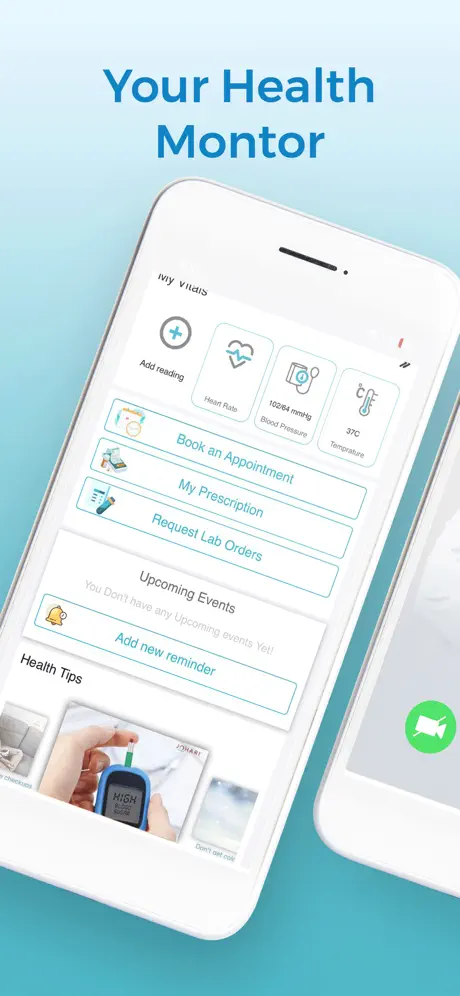
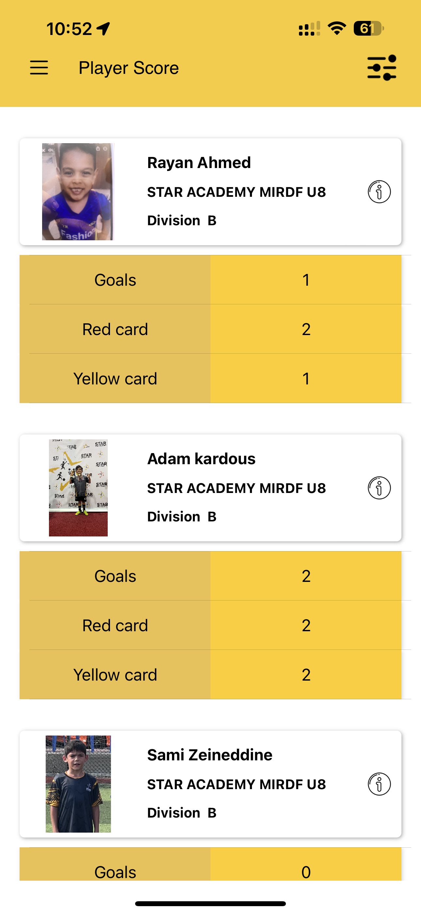

# iOS Apps 

# iHakeem 

Available on App Store! Link: [iHakeem](https://apps.apple.com/us/app/ihakeem/id1536719251?platform=iphone)

## Project Details

| **Attribute**          | **Description** |
|------------------------|------------------|
| **Company Name**       | Alamana Technology Gen. Trading Co, Kuwait |
| **Project Duration**   | June 2021 to October 2022 |
| **Tools/Technologies/Environment** | Swift UIKit, Xcode, iOS SDKs |
| **Role**               | iOS Developer |
| **Team Size**          | 7 |
| **Project Domain**     | The project aimed to revolutionize healthcare experiences by seamlessly connecting users to a vast network of healthcare providers, offering advanced and accessible services. The iHakeem project stands as a testament to advancements in healthcare technology, providing users with a holistic and convenient healthcare experience. |
| **Major Achievements** | Developed, led, and successfully deployed the project live in Kuwait. |

 

 
   
   
   

# Intely Health

## Project Details

| **Attribute**          | **Description** |
|------------------------|------------------|
| **Company Name**       | iMedHealth, USA |
| **Project Duration**   | Aug 2022 to Dec 2023 |
| **Tools/Technologies/Environment** | Swift UIKit, Xcode, iOS SDKs|
| **Role**               | iOS Developer |
| **Team Size**          | 8 |
| **Project Domain**     | The project aimed to revolutionize healthcare experiences by seamlessly connecting users to an extensive network of healthcare providers.|
| **Major Achievements** | Project leadership, Software Development,Integration of software components|

 

 
 
 
 

# MedicalAI 

## Project Details

| **Attribute**          | **Description** |
|------------------------|------------------|
| **Company Name**       | Naples, Florida 34119 |
| **Project Duration**   | Aug 2022 to Dec 2023 |
| **Tools/Technologies/Environment** | SwiftUI, Xcode, iOS SDKs|
| **Role**               | iOS Developer |
| **Team Size**          | 4 |
| **Project Domain**     | Pioneered the development of Medical AI, a groundbreaking health companion crafted with SwiftUI. The project harnessed advanced OpenAI technology to introduce an innovative chatbot, offering insightful and engaging health-related conversations.|
| **Major Achievements** | Project leadership, Software Development,Integration of software components|

 

 
 
 
 

# Star Academies Coaches

Available on App Store! Link: [Coaches](https://apps.apple.com/pk/app/star-academies-coaches/id1540379452) 

**Project Overvieww**
This comprehensive app caters not only to sports enthusiasts but also serves as a valuable tool for coaches and students alike. Providing real-time access to crucial academy news and updates, the app ensures everyone stays well-informed. Beyond its primary role in the realm of sports, the application is strategically designed to elevate the overall educational experience, with a particular focus on students aspiring to become coaches. By seamlessly organizing day-to-day workloads, the app enhances efficiency and empowers students on their educational journey.

**Challenges and Achievements**
-Faced with the challenge of handling return data from APIs with an awkward pattern in Objective-C, I delved deep into understanding the intricacies of the APIs. Despite the complexity of the data pattern, I remained determined to find a solution that would effectively address the issue.Recognizing the limitations and challenges posed by Objective-C in this context, I made the strategic decision to leverage Swift bridging. By incorporating Swift into the project, I unlocked a range of powerful features and capabilities that facilitated a more efficient and effective resolution to the problem at hand.The successful integration of Swift bridging not only demonstrated my adaptability and problem-solving skills but also highlighted my commitment to delivering high-quality solutions that meet the unique needs and challenges of each project.

**Project Goal** 
The primary goal of the app is to facilitate education and support aspiring coaches in organizing their daily tasks efficiently. Additionally, it serves as a platform for coaches and students to access essential academy news and updates, fostering a conducive learning environment and promoting continuous growth and development within the coaching community.

**Tech Used**
- Objective-C
- RESTful API’s
- Push Notification
- Firebase
- Agile Methdology

**Tech Skills**
- Software development
- iOS development
- Integration of software components

 

 
 
 
 

# Star Volleyball Academy

Available on App Store! Link: [Volleyball](https://apps.apple.com/pk/app/star-volleyball-academy/id6463856723)  

**Project Overvieww**
Established in 2023, the Star Volleyball Academy app stands as a beacon of excellence in sports education in the UAE. Tailored for aspiring athletes of all ages, this app seamlessly integrates with the Academy's training programs. It simplifies the process of venue selection and class bookings for volleyball sessions in Dubai and Sharjah, offering users a smooth and secure payment gateway. With features like easy registration and in-app payments, the app nurtures a vibrant community, providing instant access to athlete progress reports, training outlines, and exclusive media content, including instructional videos. This comprehensive platform connects parents, students, and athletes to the dynamic world of volleyball training and events.

**Challenges and Achievements**
- To meet the client's request for the application to be developed in Objective-C, I embarked on a comprehensive learning journey to master the language. Leveraging my dedication and expertise, I successfully implemented the entire application using Objective-C, ensuring adherence to the client's specifications and preferences. Upon completion, I successfully submitted the application to the App Store, marking a significant milestone in fulfilling the client's challenge. This achievement underscores my versatility and adaptability as a developer, capable of delivering high-quality solutions in diverse programming languages and environments.
- To address the challenge of dynamically managing rows in a view based on API data while ensuring custom ordering, I implemented a solution to create a dynamic view. This view intelligently adjusts cell placement based on incoming data, offering a seamless and tailored user experience.

**Project Goal** 
The primary goal of the Star Volleyball Academy app is to enhance the experience of parents and students involved in volleyball training by providing a seamless and convenient platform for communication, class bookings, and payment management

**Tech Used**
- Objective-C
- RESTful API’s
- Push Notification
- Firebase
- Agile Methdology
- MVC
- Google Maps 
  
**Tech Skills**
- Software development
- iOS development
- Integration of software components

 

 
  
  
  

# Star Gymnastics Academy

Available on App Store! Link: [Gymnastics](https://apps.apple.com/pk/app/star-gymnastics-academy/id6464569426)  

**Project Overvieww**
Infused with the essence of volleyball but adorned with subtle modifications, Gymnastics delivers a familiar yet distinctive sporting experience. The journey to unveil this application on the App Store was marked by unique challenges that added a touch of exclusivity to the development process.

**Challenges and Achievements**
App Store Compliance:
- Submitting the app to the App Store posed challenges in ensuring strict adherence to Apple's guidelines and policies.Rigorous testing and meticulous attention to detail were paramount to meet the stringent criteria for app approval.
- The challenges encountered during the development journey underscored the dedication and problem-solving skills of the development team.Overcoming obstacles resulted in a refined and enjoyable sports application, showcasing the team's commitment to excellence.
  
**Project Goal** 
The primary goal of the Star Gymnastics Academy app is to enhance the experience of parents and students involved in gymnastics training by providing a seamless and convenient platform for communication, class bookings, and payment management

**Tech Used**
- Objective-C
- RESTful API’s
- Push Notification
- Firebase
- Agile Methdology
- MVC
- Google Maps 
  
**Tech Skills**
- Software development
- iOS development
- Integration of software components
  
 

 
 
 
 

# Book With Star

Available on App Store! Link: [BWS](https://apps.apple.com/pk/app/book-with-star/id1629308220) 

**Project Overvieww**
The app caters to the dynamic lifestyle of the United Arab Emirates, presenting a streamlined platform for discovering and booking premier sports facilities.

**Challenges and Achievements**
- Encountering the challenge of implementing searchable popups, I identified a gap in available solutions within SwiftUI and third-party libraries. In response, I embarked on creating a custom popup feature capable of facilitating content search. This endeavor required a blend of creativity, problem-solving skills, and technical expertise to deliver a seamless user experience. Through meticulous design and development, I successfully crafted a solution that met the unique requirements, demonstrating my ability to innovate and overcome obstacles in app development.
- Encountering challenges with the native date picker in SwiftUI, I recognized the need to fulfill the client's requirements for a custom solution. To address this, I took the initiative to develop a bespoke [date picker](https://github.com/ArslaniOS/DatePickerView) tailored to the app's color scheme and design guidelines. This involved leveraging SwiftUI's flexibility and customization capabilities to create a user-friendly and aesthetically pleasing interface. By crafting a custom date picker, I ensured alignment with the client's vision while enhancing the overall user experience.
  
**Project Goal** 
Book with Star transcends the conventional sports booking experience, introducing a platform that seamlessly aligns with the vibrant lifestyle of the UAE. The app's commitment to efficiency, innovation, and user-centric design is evident in its features and the solutions implemented to overcome challenges. As users engage with Book with Star, they experience a new standard in sports engagement—an experience marked by accessibility, diversity, and a touch of technological brilliance.

**Tech Used**
- SwiftUI 
- RESTful API’s
- Push Notification
- Firebase
- Agile Methdology

**Tech Skills**
- Software development
- iOS development
- Integration of software components
  
 

 
 
 

# Book with Star Admin

Available on App Store! Link: [BwsAdmin](https://apps.apple.com/pk/app/book-with-star-admin/id6451918028)

**Project Overvieww**
In a remarkable achievement, the Book with Star Admin app was successfully delivered within a tight 3-month timeframe. This cutting-edge sports tournament management app is strategically designed to enhance the experience for players, team managers, and referees, setting a new standard in the industry.

**Challenges and Achievements**
Faced with the challenge of dynamically managing data fetched from APIs while ensuring editable rows that retain user input until explicitly saved, I employed innovative strategies to address the issue.By leveraging the flexibility of UITextField delegate methods and tags, I devised a solution to dynamically allocate rows based on the data retrieved from the APIs. Each row was configured to accommodate user input and retain the entered data until the user initiated the save action.
Through meticulous management of UITextField delegate methods and tags, I implemented a robust system that effectively tracked and preserved user input across multiple rows. This approach enabled users to interact with the data seamlessly, making edits as needed and ensuring that changes were persisted only upon explicit user confirmation.
By implementing this solution, I not only resolved the immediate challenge of managing API data dynamically but also created a user-friendly experience that empowered users to interact with the data confidently and efficiently.

**Project Goal** 
The primary goal of the "Book with Star Admin" project is to provide a comprehensive and user-friendly solution for organizing and participating in sports tournaments. The app aims to streamline tournament management processes and enhance the overall experience for players, team managers, referees, and organizers alike.

 **Tech Used**
- Swift UIKIT  
- RESTful API’s
- Push Notification
- Firebase
- Agile Methdology
- MVVM

**Tech Skills**
- Software development
- iOS development
- Integration of software components

 

 
   
   
   

